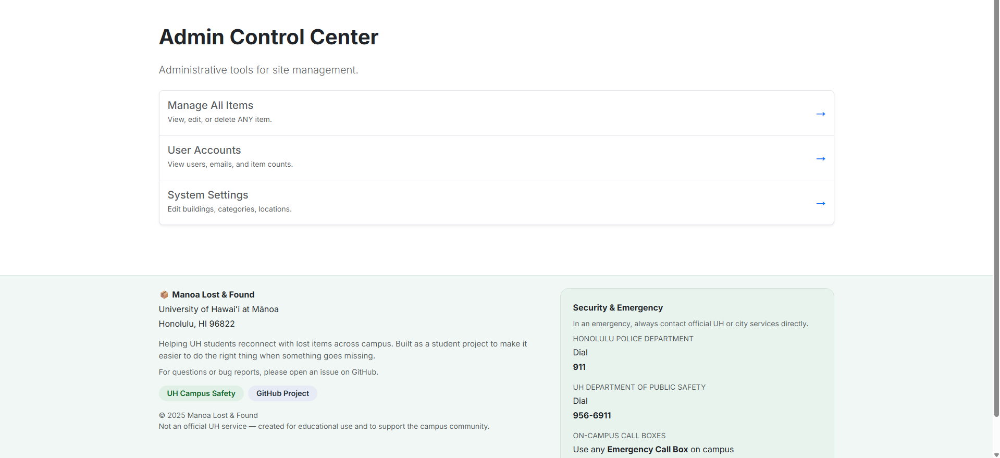
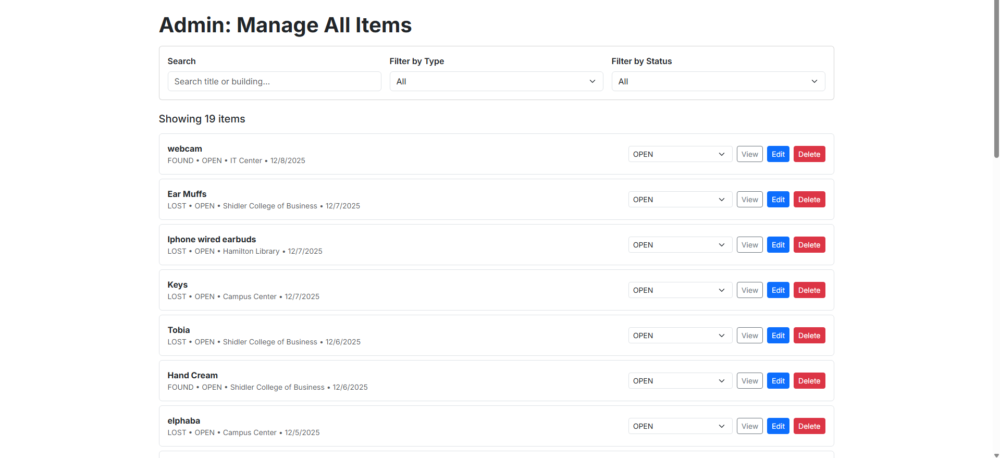
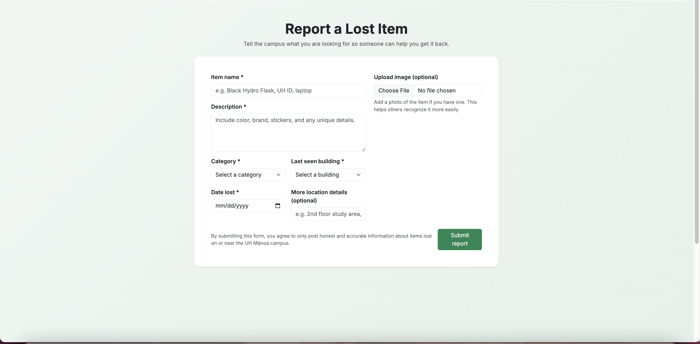
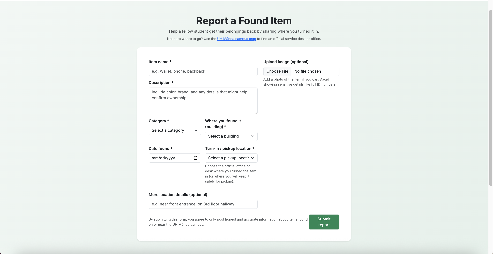
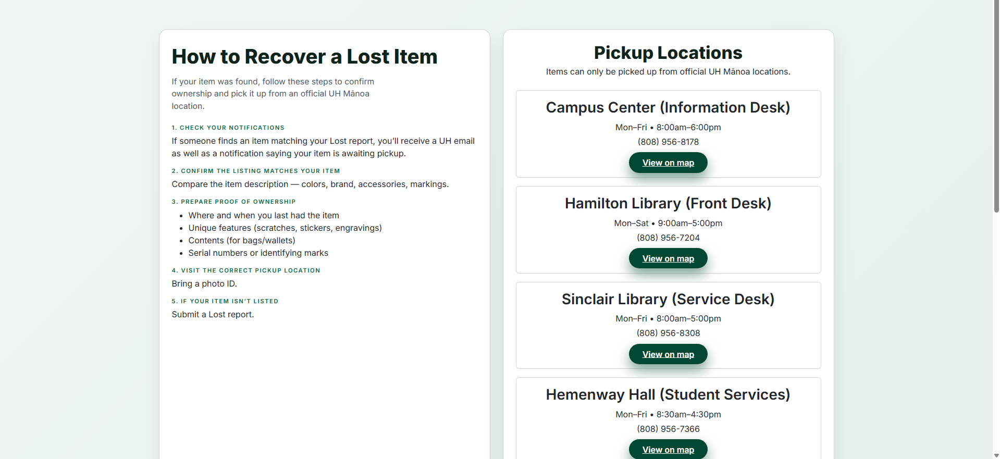

<!-- Hero / Title -->
<h1 align="center">Manoa Lost &amp; Found</h1>
<p align="center"><em>A UH Manoa community app to report, browse, and recover lost items — built by students for students.</em></p>

<p align="center">
  <a href="https://manoa-lost-found.github.io"><b>Live Site</b></a> ·
  <a href="https://github.com/orgs/manoa-lost-found/repositories"><b>View on GitHub</b></a> ·
  <a href="https://github.com/manoa-lost-found/manoa-lost-and-found/issues"><b>Open an Issue</b></a> ·
  <a href="https://docs.google.com/document/d/1SYR9UNlJHreSRPiQces7M1lXAMndSw5lAGJjuAcbBvU/edit?usp=sharing"><b>Team Contract</b></a>
</p>

<p align="center">
  
  
  
  <a href="https://github.com/manoa-lost-found/manoa-lost-and-found/actions/workflows/ci.yml">
    
  </a>
</p>

**Proposers:** Jermaine Bruno • Michael Lau • Brandon Nguyen • Edward Uzueta • Justin Lai  
**Date:** December 13, 2025

---

## Table of Contents

- [Overview](#overview)
- [Roles & Capabilities](#roles--capabilities)
- [App Features (M1 Scope)](#app-features-m1-scope)
- [App Features (M2 Scope)](#app-features-m2-scope)
- [App Features (M3 Scope)](#app-features-m3-scope)
- [User Guide (Mockup Walkthrough)](#user-guide-mockup-walkthrough)
- [Deployment](#deployment)
- [Risks & Mitigations](#risks--mitigations)
- [Team](#team)
- [Developers Guide](#developers-guide)

---

## Overview

### The Problem

Each semester, UH Manoa students lose countless items — IDs, water bottles, textbooks, AirPods, and other valuables. While the university technically has a Lost & Found system, it’s inefficient and fragmented. The current process involves emailing departments, calling offices, or physically visiting locations like Campus Center or the Library. There’s no centralized platform for checking updates, leaving students unsure if their lost items will ever be found.

### The Solution

**Manoa Lost & Found** is a centralized digital platform that unifies reporting and recovering lost items across UH Manoa. Students and staff can:

- Post **Lost** or **Found** items with descriptions, images, and locations.
- Receive **notifications** when potential matches are found.
- Use **UH authentication** for security and campus-only access.
- Route physical returns through **official UH offices** for verified recovery.

> All item exchanges are handled through official UH offices — no private handoffs.

---

## Roles & Capabilities

### Users (Students & Staff)

- Create **Lost Item** reports including photo, category, description, and last-seen location/time.
- Set **alerts/preferences** (keywords, buildings, or item types).
- Access a **personal dashboard** showing “My Lost Items,” “My Found Items,” and “Matches & Alerts.”

### Finders (Any Authenticated User)

- Post **Found Item** reports (photo, where/when found, where turned in).
- Use an in-app **“How to Turn In Items”** page listing official drop-off offices and instructions.
- Notify the rightful owner securely via UH email without direct contact.

### Admins (Campus Center / Library Staff)

- **Verify** items received at official drop-off points.
- Update item status (Received → Ready for Pickup → Recovered).
- **Flag duplicates**, moderate posts, and manage user roles.
- Configure **drop-off locations**, contact info, and office hours.

---

## App Features (M1 Scope)

<a href="https://github.com/orgs/manoa-lost-found/projects/1/views/7"><b>M1 Project Page</b></a>

- UH-authenticated access (campus-only)
- Tabs for **Lost** and **Found** item feeds
- Advanced filters: category, date, building, keyword
- Create/Edit/Delete posts with photo uploads

> M1 focuses on **design and functionality**

---

## App Features (M2 Scope)

<a href="https://github.com/orgs/manoa-lost-found/projects/2/views/1"><b>M2 Project Page</b></a>

- User Dashboard
- Pages for detailed item descriptions
- Admin functions
- Item recovery instructions
- Turning in items instructions
- Turn-in Locations directory (Campus Center, Library, etc.)  

> M2 focuses on **implementing more user functions**

---

## App Features (M3 Scope)

<a href="https://github.com/orgs/manoa-lost-found/projects/4/views/1"><b>M3 Project Page</b></a> 

- Notification system for potential matches
- Admin dashboard

> M3 focuses on **finalizing functionality and aesthetics**

---

## User Guide (Mockup Walkthrough)

1. **Landing → Login (UH SSO)** → Personalized **Dashboard**.  
2. **Report Lost Item**  
   - *Category:* Bottle  
   - *Description:* Blue Hydroflask with straw and dog stickers  
   - *Last Seen:* POST Room 318  
   - *Photo:* Upload from phone  
3. Listing appears in **Lost Items** feed and **My Lost Items**.  
4. Owner receives **alerts** when matching Found posts appear.  
5. **Finder** posts a Found item, turns it in at **Campus Center**, and notifies the owner through the app.  
6. **Admin** verifies the item and updates status to **Ready for Pickup**.  
7. Owner retrieves the item; system records a successful recovery.

---

## User Guide (Walkthrough)

### Landing Page

  


Users must sign in and sign up with an email ending in @hawaii.edu, otherwise the system will reject attempts (our current system in-place for UH SSO login).

Landing → Login (UH SSO) → Personalized Dashboard.

### Lost/Found Feed with Filters  


Shows Lost and Found items with filters (category, date, building, keyword):

- Displays all student-created lost and found posts with an image, tags, status, and brief sentence
- Users can click the '**View details**' button to open the full post with longer descriptions

### User Dashboard (My Lost / My Found / Matches)  


Displays the user’s Lost and Found posts plus alerts for matches

- Users can view and edit their posts quickly and efficiently
- Users can delete posts and delete their account from this page

### Admin Dashboard 



Displays the Admin's various site functions

- Admin can view all posts, edit them, change status, and delete posts
- Admin can view all registered accounts, delete them, ban them, as well as promote/demote them\
- Admin can edit site settings



### Post Lost Item Form  



Form to report a lost item with photo upload, description, and last-seen location/time.

### Post Found Item Form  



Form for users who found an item. Includes where/when found and where it was turned in.

### Item Details Page  


Shows full details about one item (photo, description, contact).

- Designed to be an optional place for users to include more information about an item that they have found or lost
- Allows for more specific identification in cases where similar items may be found

### Recovery Instructions  

**Recovery Overview**  


- Detailed instructions of the recovery process for picking up lost items
- Locations directory for ease of access on the Map
- Admins will verify items at designated locations

---

## Community Feedback
We gathered feedback from 5 UH community members who tested the application and reviewed the interface, content, and user flow.

### Overall Impressions
Testers found the concept intuitive and appreciated the centralized approach to lost-and-found reporting. The Lost/Found feed and dashboard structure were easy to understand, and users felt the app addressed a real campus need.

### Common Feedback Themes
- Users suggested improving visual clarity by spacing out dense instruction sections, reducing heavy button drop-shadows, and using more consistent image quality on the home page. Collapsible FAQ sections were recommended to reduce visual clutter.
- Some testers noted that certain FAQ entries felt overly casual (e.g., emojis in serious safety-related content). They suggested reserving a lighter tone for motivational sections and using a more professional tone for security-related information.
- Testers encountered a submission error when reporting a lost item and recommended clearer confirmation or error messaging. Minor wording and grammar consistency issues (e.g., “Log in” vs. “Login”) were also identified.
- Suggestions included adding direct links or contact info for DPS/Admin in relevant sections, linking to campus emergency call box maps, and improving recovery communication (such as notifying item owners when a matching found item is posted).
- One tester noted that account creation currently allows weak passwords and suggested enforcing basic password requirements for improved security.

### Takeaways
This feedback highlighted areas for refinement in UI polish, tone consistency, error handling, and security, while affirming that the core idea and functionality are valuable to the UH Mānoa community. Many of these insights informed planned improvements for later milestones.

---

## Deployment

- **Live Site:** <a href="https://manoa-lost-and-found.vercel.app/">https://manoa-lost-and-found.vercel.app</a>  
- **Repository:** <a href="https://github.com/manoa-lost-found/manoa-lost-and-found">https://github.com/manoa-lost-found/manoa-lost-and-found</a>

---

## Risks & Mitigations

| Risk | Mitigation |
|---|---|
| UH authentication complexity | Start with demo/login; integrate UH SSO later |
| Matching accuracy | Start with keyword filters; add fuzzy/AI synonyms later |
| Duplicate posts | Simple duplicate detection + admin merge tools |
| Privacy & safety | No private handoffs; all returns through UH offices |
| Moderation load | Admin workflows + flags + status updates |

---

## Team

| Name | Focus |
|---|---|
| **Jermaine Bruno** | Product & Admin workflows |
| **Michael Lau** | Matching & Notifications |
| **Brandon Nguyen** | UI/UX & Mockups |
| **Edward Uzueta** | Data Model & Locations/Offices |
| **Justin Lai** | Frontend Integration |

---

## Developers Guide

This is the **Manoa Lost & Found Developers Guide**. This section will walk you through the process of donwloading, installing, running, and modifying the system. 

### System Requirements

Make sure you have the following installed:

- Node.js v18+
- npm (bundled with Node.js)
- Git (version control)
- Visual Studio Code (recommended)
- PostgreSQL (via Neon/Vercel Postgres)
- A modern web browser (Chrome, Firefox, Safari)
- Playwright browsers (installed automatically)

### Downloading the Project

Clone the repository:


```bash
git clone https://github.com/manoa-lost-found/manoa-lost-and-found.git
cd manoa-lost-and-found
```

---

### Environment Setup

Create a `.env` file in the project root and paste in your environment variables from **Vercel Postgres and NextAuth**.


```env
NEXTAUTH_URL="http://localhost:3000"
NEXTAUTH_SECRET="your-secret-here"

POSTGRES_DATABASE="verceldb"
POSTGRES_HOST="***"
POSTGRES_PASSWORD="***"
POSTGRES_USER="default"

POSTGRES_PRISMA_URL="postgres://..."
POSTGRES_URL_NON_POOLING="postgres://..."
POSTGRES_URL_NO_SSL="postgres://..."

DATABASE_URL="${POSTGRES_PRISMA_URL}"
```

**Important**:
On Vercel, you must add these variables manually under:
**Settings → Environment Variables**

---

### Installing Dependencies

Install all project dependencies:

```bash
npm install
```

---

### Database Setup (Prisma)

Generate the Prisma client:

```bash
npx prisma generate
```
Push the schema to the database:
```bash
npx prisma db push
```
Seed the database (adds an admin + a normal UH user + default items):
```bash
npx prisma db seed
```

---

### Running the Application

Start the development server:

```bash
npm run dev
```

---

### Project Structure

```
app/                    → Next.js 14 App Router pages & layouts
  api/                  → Server API routes (POST, GET, DELETE...)
  dashboard/            → Logged-in user dashboard
  list/                 → Items feed
  report/               → Report Lost / Report Found pages
  item/[id]/            → Item detail + item edit pages

components/             → Reusable UI components (Navbar, Cards, etc.)
lib/                    → Prisma, authentication, helper logic
prisma/                 → Prisma schema + seed script
public/                 → Images & static files
tests/                  → Playwright tests
styles/                 → Global Tailwind/CSS

```

---

### Modifying the System

#### Updating the Navbar

```
components/Navbar.tsx
```
- Add or remove navigation items
- Show/hide links based on session login state
- Display the UH user email and role
- Link to the Admin Panel only if role = ADMIN

#### Adding New Pages

Create a folder inside `app/:`

```
app/campus-map/page.tsx
```

This automatically becomes available at:
```
/campus-map
```

All pages use the App Router, React Server Components, and TypeScript.

#### Updating the Database Schema

Modify:
```
prisma/schema.prisma
```

Then apply your changes:

```bash
npx prisma db push
npx prisma generate
```

If you change enums or relations, regenerate again.

#### Creating API Routes

API routes live in:

```
app/api/<route>/route.ts
```

#### Updating Authentication

Authentication logic is defined in:

```
lib/authOptions.ts
```

From here you can:
- Restrict routes by user role
- Limit access to /admin pages
- Modify sign-in behavior
- Change session callbacks

All protected pages use:

```ts
getServerSession(authOptions)
```

---

## Testing

Run Playwright:

```bash
npx playwright test
```

Headed mode:

```bash
npx playwright test --headed
```

The tests cover:
- All pages load
- Forms accept valid input
- Protected routes redirect correctly
- Admin pages only load for admin users

---

## Continuous Integration

GitHub Actions automatically checks:

- ESLint  
- Playwright  
- Build success  

---

## Deployment

1. Push your code to GitHub
2. Connect your repo to Vercel
3. Add environment variables in Vercel settings
4. Press “Deploy” or wait for auto-deploy on push
5. Confirm PostgreSQL database is connected (Neon/Vercel Postgres)

---

## Contributing Workflow

```bash
git checkout -b issue-XX-description
git commit -m "issue-XX: implemented feature"
git push -u origin issue-XX-description
```

Open a Pull Request → link the issue → move card on project board → get review → merge.

---

<p align="center"><sub>Made with ❤️ by UH Manoa students — inspired by Bowfolios/Techfolios.</sub></p>

<p align="center">
  <a href="https://github.com/manoa-lost-found/manoa-lost-found/edit/Project-page/docs/index.md">✏️ Edit this page on GitHub</a>
</p>