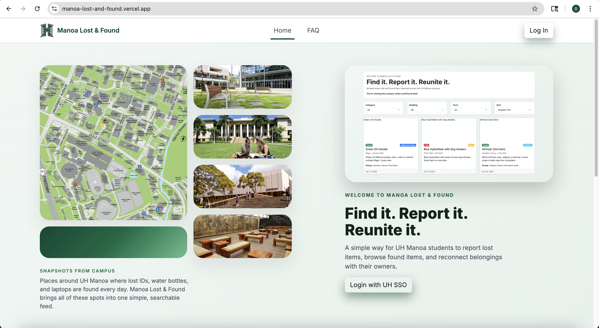
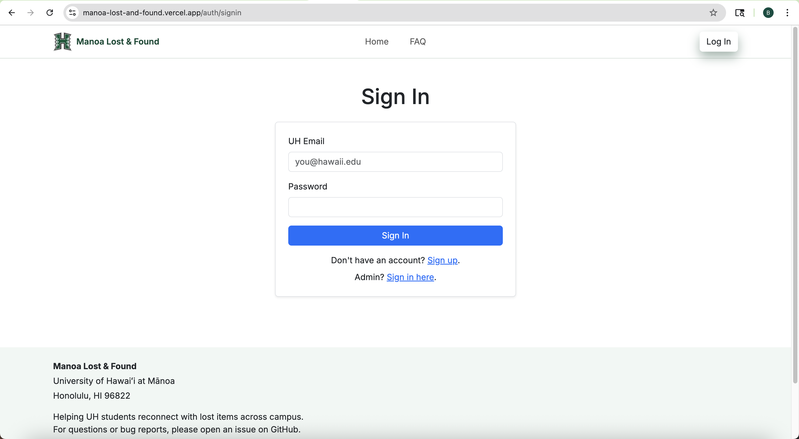
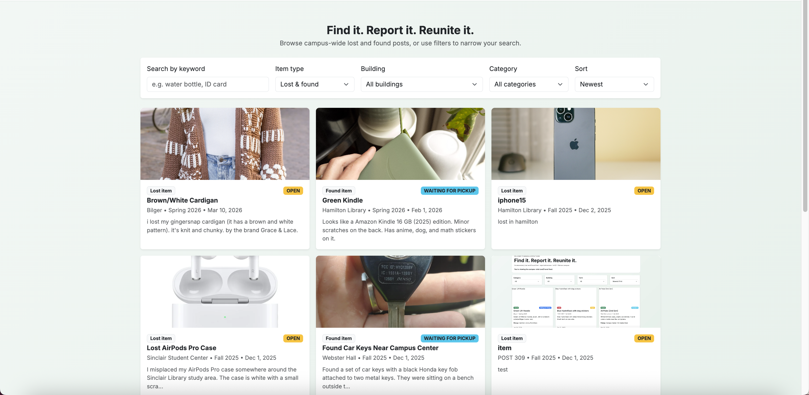
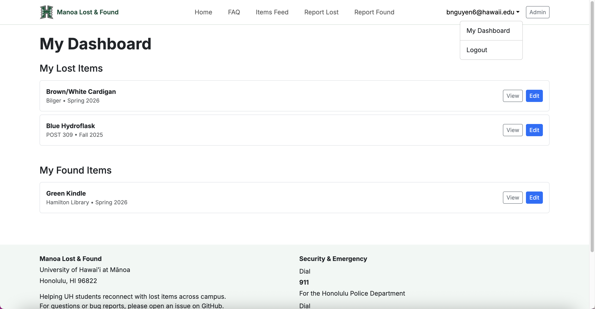
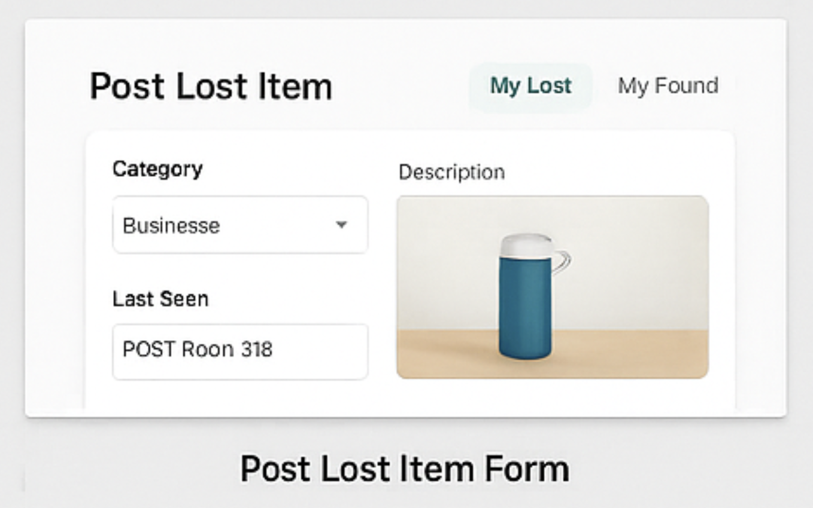
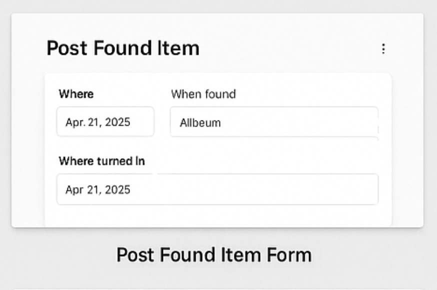
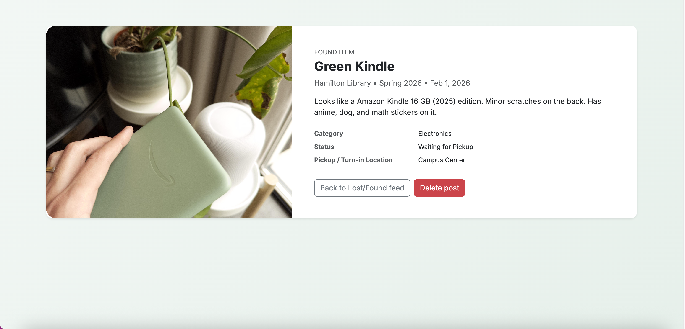
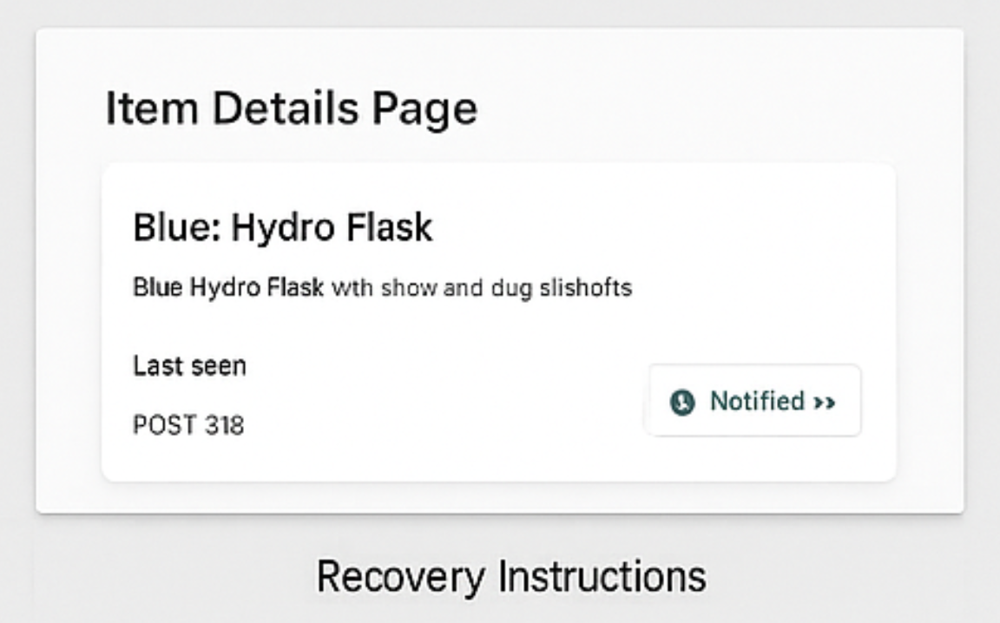
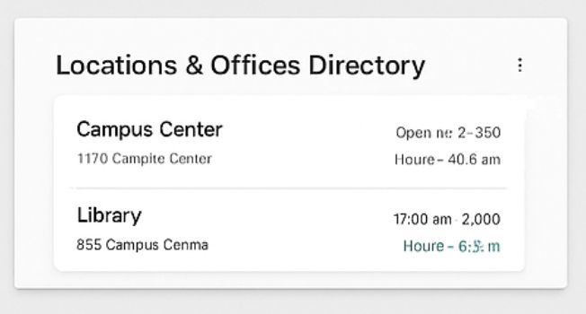
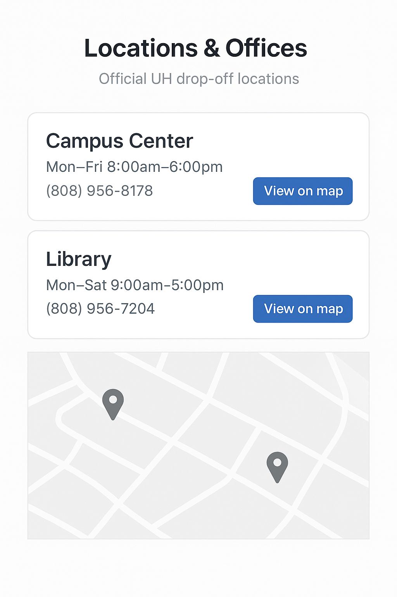

<!-- Hero / Title -->
<h1 align="center">Manoa Lost &amp; Found</h1>
<p align="center"><em>A UH Manoa community app to report, browse, and recover lost items — built by students for students.</em></p>

<p align="center">
  <a href="https://manoa-lost-found.github.io"><b>Live Site</b></a> ·
  <a href="https://github.com/orgs/manoa-lost-found/repositories"><b>View on GitHub</b></a> ·
  <a href="https://github.com/manoa-lost-found/manoa-lost-found/issues/new"><b>Open an Issue</b></a> ·
  <a href="https://docs.google.com/document/d/1SYR9UNlJHreSRPiQces7M1lXAMndSw5lAGJjuAcbBvU/edit?usp=sharing"><b>Team Contract</b></a>
</p>

<p align="center">
  
  
  
</p>

**Proposers:** Jermaine Bruno • Michael Lau • Brandon Nguyen • Edward Uzueta • Justin Lai  
**Date:** December 2, 2025

---

## Table of Contents
- [Overview](##-overview)
- [Roles & Capabilities](##-roles--capabilities)
- [App Features (M1 Scope)](##-app-features-m1-scope)
- [App Features (M2 Scope)](##-app-features-m2-scope)
- [User Guide (Mockup Walkthrough)](##-user-guide-mockup-walkthrough)
- [Deployment](##-deployment)
- [Risks & Mitigations](##-risks--mitigations)
- [Potential Enhancements](##-potential-enhancements)
- [Team](##-team)
- [Developers Guide](##-developers-guide)

---

##  Overview

### The Problem
Each semester, UH Manoa students lose countless items — IDs, water bottles, textbooks, AirPods, and other valuables. While the university technically has a Lost & Found system, it’s inefficient and fragmented. The current process involves emailing departments, calling offices, or physically visiting locations like Campus Center or the Library. There’s no centralized platform for checking updates, leaving students unsure if their lost items will ever be found.

### The Solution
**Manoa Lost & Found** is a centralized digital platform that unifies reporting and recovering lost items across UH Manoa. Students and staff can:
- Post **Lost** or **Found** items with descriptions, images, and locations.
- Receive **notifications** when potential matches are found.
- Use **UH authentication** for security and campus-only access.
- Route physical returns through **official UH offices** for verified recovery.

> All item exchanges are handled through official UH offices — no private handoffs.

---

## Roles & Capabilities

### Users (Students & Staff)
- Create **Lost Item** reports including photo, category, description, and last-seen location/time.
- Set **alerts/preferences** (keywords, buildings, or item types).
- Access a **personal dashboard** showing “My Lost Items,” “My Found Items,” and “Matches & Alerts.”

### Finders (Any Authenticated User)
- Post **Found Item** reports (photo, where/when found, where turned in).
- Use an in-app **“How to Turn In Items”** page listing official drop-off offices and instructions.
- Notify the rightful owner securely via UH email without direct contact.

### Admins (Campus Center / Library Staff)
- **Verify** items received at official drop-off points.
- Update item status (Received → Ready for Pickup → Recovered).
- **Flag duplicates**, moderate posts, and manage user roles.
- Configure **drop-off locations**, contact info, and office hours.

---

## App Features (M1 Scope)

<a href="https://github.com/orgs/manoa-lost-found/projects/1/views/7"><b>M1 Project Page</b></a>

- UH-authenticated access (campus-only)
- Tabs for **Lost** and **Found** item feeds
- Advanced filters: category, date, building, keyword
- Create/Edit/Delete posts with photo uploads

> M1 focuses on **design and functionality**

## App Features (M2 Scope)

<a href="https://github.com/orgs/manoa-lost-found/projects/2/views/1"><b>M2 Project Page</b></a>

- User Dashboard
- Pages for detailed item descriptions
- Admin functions

- Item recovery instructions
- Turning in items instructions
- Turn-in locations directory

> M2 focuses on **implementing more user functions**

## Future Features
- Notification system for potential matches
- Admin verification dashboard
- “How to Turn In Items” instructions page  
- Locations directory (Campus Center, Library, etc.)  

---

## User Guide (Mockup Walkthrough)

1. **Landing → Login (UH SSO)** → Personalized **Dashboard**.  
2. **Report Lost Item**  
   - *Category:* Bottle  
   - *Description:* Blue Hydroflask with straw and dog stickers  
   - *Last Seen:* POST Room 318  
   - *Photo:* Upload from phone  
3. Listing appears in **Lost Items** feed and **My Lost Items**.  
4. Owner receives **alerts** when matching Found posts appear.  
5. **Finder** posts a Found item, turns it in at **Campus Center**, and notifies the owner through the app.  
6. **Admin** verifies the item and updates status to **Ready for Pickup**.  
7. Owner retrieves the item; system records a successful recovery.

---

## User Guide (Walkthrough)

### Landing Page



Users must sign in and sign up with an email ending in @hawaii.edu, otherwise the system will reject attempts (our current system in-place for UH SSO login).

Landing → Login (UH SSO) → Personalized Dashboard.

### Lost/Found Feed with Filters  


Shows Lost and Found items with filters (category, date, building, keyword):
- Displays all student-created lost and found posts with an image, tags, status, and brief sentence
- Users can click the '**View details**' button to open the full post with longer descriptions

### User Dashboard (My Lost / My Found / Matches)  


Displays the user’s Lost and Found posts plus alerts for matches
- Users can view and edit their posts quickly and efficiently

### Post Lost Item Form  


Form to report a lost item with photo upload, description, and last-seen location/time.

### Post Found Item Form


Form for users who found an item. Includes where/when found and where it was turned in.

### Item Details Page


Shows full details about one item (photo, description, contact).
- Designed to be an optional place for users to include more information about an item that they have found or lost
- Allows for more specific identification in cases where similar items may be found

### Recovery Instructions  
**Recovery Overview**


AI-Generated Mockup of the item recovery instructions page, giving brief steps.

**1. Turning in the Item**


AI-Generated Mockup of a page detailing the locations available for item pickups.

**2. Staff Verifies the Item**


AI-Generated Mockup of the item verification page, detailing the current process of verification by staff.

Step-by-step instructions for turning items in and recovering them through UH offices.

### Locations & Offices Directory  


AI-Generated Mockup that lists official UH drop-off offices (Campus Center, Library, etc.) with map links.

---

## Deployment

- **Live Site:** <a href="https://manoa-lost-and-found.vercel.app/">https://manoa-lost-and-found.vercel.app</a>
- **Repository:** <a href="https://github.com/manoa-lost-found/manoa-lost-and-found">https://github.com/manoa-lost-found/manoa-lost-and-found</a>

## Risks & Mitigations

| Risk | Mitigation |
|---|---|
| UH authentication complexity | Start with demo/login; integrate UH SSO later |
| Matching accuracy | Start with keyword filters; add fuzzy/AI synonyms later |
| Duplicate posts | Simple duplicate detection + admin merge tools |
| Privacy & safety | No private handoffs; all returns through UH offices |
| Moderation load | Admin workflows + flags + status updates |

---

## Potential Enhancements

- AI synonym/fuzzy search (e.g., “AirPods” ≈ “Apple earbuds”)  
- QR poster generator linking to item pages  
- Campus map markers for last-seen and turn-in points  
- Auto-archive stale posts unless renewed  
- Recovery metrics (e.g., “123 items reunited this semester”)  

---

## Team

| Name | Focus |
|---|---|
| **Jermaine Bruno** | Product & Admin workflows |
| **Michael Lau** | Matching & Notifications |
| **Brandon Nguyen** | UI/UX & Mockups |
| **Edward Uzueta** | Data Model & Locations/Offices |
| **Justin Lai** | Frontend Integration |

---

## Developers Guide
This is the **Manoa Lost & Found Developers Guide**. This section will walk you through the process of donwloading, installing, running, and modifying the system. 

### System Requirements
Make sure you have the following installed:
- Node.js v18+
- npm (bundled with Node.js)
- Git (version control)
- Visual Studio Code (recommended)
- PostgreSQL (via Neon/Vercel Postgres)
- A modern web browser (Chrome, Firefox, Safari)
- Playwright browsers (installed automatically)

### Downloading the Project
Clone the repository:
``
git clone https://github.com/<your-org>/<your-project>.git
cd manoa-lost-and-found
``
### Environment Setup
Create a .env file in the project root and paste in your environment variables from **Vercel Postgres and NextAuth**.

Example:
``
NEXTAUTH_URL="http://localhost:3000"
NEXTAUTH_SECRET="your-secret-here"

POSTGRES_DATABASE="verceldb"
POSTGRES_HOST="***"
POSTGRES_PASSWORD="***"
POSTGRES_USER="default"

POSTGRES_PRISMA_URL="postgres://..."
POSTGRES_URL_NON_POOLING="postgres://..."
POSTGRES_URL_NO_SSL="postgres://..."

DATABASE_URL="${POSTGRES_PRISMA_URL}"
``

**Important**:
On Vercel, you must add these variables manually under:
Settings → Environment Variables.

### Installing Dependencies
Install all project dependencies:
``
npm install
``

### Database Setup (Prisma)
Generate the Prisma client:
``
npx prisma generate
``
Push the schema to the database:
``
npx prisma db push
``
Seed the database (adds an admin + a normal UH user + default items):
``
npx prisma db seed
``

### Running the Application
Start the development server:
``
npm run dev
``
### Project Structure
``
app/                    → Next.js 14 App Router pages & layouts
  api/                  → Server API routes (POST, GET, DELETE...)
  dashboard/            → Logged-in user dashboard
  list/                 → Items feed
  report/               → Report Lost / Report Found pages
  item/[id]/            → Item detail + item edit pages
components/             → Reusable UI components (Navbar, Cards, etc.)
lib/                    → Prisma, authentication, helper logic
prisma/                 → Prisma schema + seed script
public/                 → Images & static files
tests/                  → Playwright tests
styles/                 → Global Tailwind/CSS
``
### Modifying the System
**Updating the Navbar**
```
components/Navbar.tsx
```
- Add or remove navigation items
- Show/hide links based on session login state
- Display the UH user email and role
- Link to the Admin Panel only if role = ADMIN

**Adding New Pages**
Create a folder inside app/:
``
app/campus-map/page.tsx
``
This automatically becomes available at:
``
/campus-map
``
All pages use the App Router, React Server Components, and TypeScript.

**Updating the Database Schema**
Modify:
``
prisma/schema.prisma
``
Then apply your changes:
``
npx prisma db push
npx prisma generate
``
If you change enums or relations, regenerate again.

**Creating API Routes**
API routes live in:
``
app/api/<route>/route.ts
``
Example:
app/api/items/add/route.ts
``
Routes typically export POST, GET, or DELETE handlers.

**Updating Authentification**
Authentication logic is defined in:
``
lib/authOptions.ts
``
From here you can:
- Restrict routes by user role
- Limit access to /admin pages
- Modify sign-in behavior
- Change session callbacks

All protected pages use:
``
getServerSession(authOptions)
``

### Testing
**Playwright Tests (Availability)**
To run Playwright tests:
``
npx playwright test
``
To run in headed mode:
``
npx playwright test --headed
``
The tests cover:
- All pages load
- Forms accept valid input
- Protected routes redirect correctly
- Admin pages only load for admin users

### Continuous Integration
Your GitHub Actions workflow automatically runs on each push to main:
- ESLint
- Playwright tests
- Install & build

### Deployment
Deployment uses Vercel.

Steps:
1. Push your code to GitHub
2. Connect your repo to Vercel
3. Add environment variables in Vercel settings
4. Press “Deploy” or wait for auto-deploy on push
5. Confirm PostgreSQL database is connected (Neon/Vercel Postgres)

### Contributing Workflow
Standard Issue Driven Project Management workflow:
``
git checkout -b issue-XX-brief-description
git commit -m issue-xx: "Added feature"
git push -u origin feature/some-feature
``
Open a Pull Request → link the issue → move card on project board → get review → merge.

---

<p align="center"><sub>Made with ❤️ by UH Manoa students — inspired by Bowfolios/Techfolios.</sub></p>

<p align="center">
  <a href="https://github.com/manoa-lost-found/manoa-lost-found/edit/Project-page/docs/index.md">✏️ Edit this page on GitHub</a>
</p>
